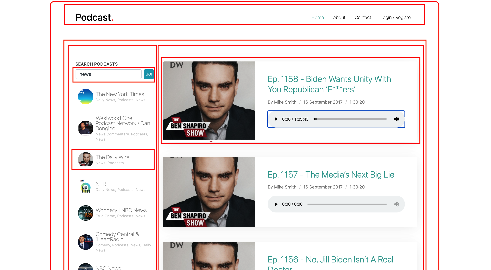

# podcast-search [Live Demo](https://podcast-search-l1akz0.turbo360-vertex.com/)

This project was built with Turbo 360. To learn more, click here: https://www.turbo360.co



## Instructions

After cloning into repo, cd to project root directory and install dependencies:

```
$ npm install
```

To run dev server, install Turbo CLI globally:

```
$ sudo npm install turbo-cli -g
```

Then run devserver from project root directory:

```
$ turbo devserver
```

To build for production, run build:

```
$ npm run build
```
